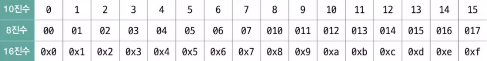
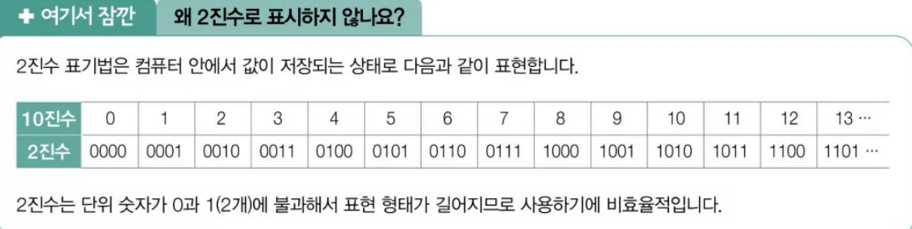
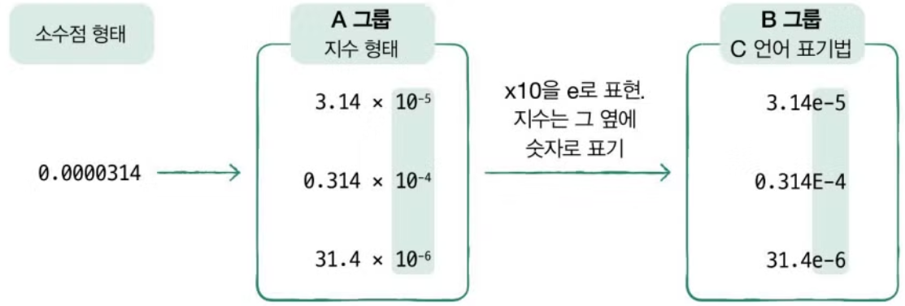
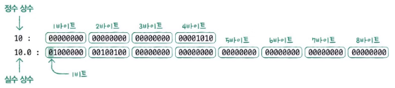

C언어는 메모리에 직접 접근 하거나 비트 단위의 연산을 수행하기 때문에 데이터를 효율적으로 처리할 수 있다. 

데이터를 효율적으로 처리 하려면 데이터가 메모리에 저장 되는 방식이 중요함으로, 정수, 실수, 문자, 문자열이 어떻게 저장되고 컴파일 된 후 어떤 형태로 바뀌는지 파악하여야 한다.

정수, 실수, 문자, 문자열 데이터를 프로그램에서 저장하는 형태로 변수와 상수가 존재한다.

변수는 값을 바꿀 수 있는 형태를 말하고 상수는 값을 변경할 수 없는 형태를 말한다.

- 정수 상수 표현은 기본적으로 아라비아 숫자를 사용하고 8진수, 10진수, 16진수로 표현할 수 있다.

      10진수는 우리가 흔히 사용하는 숫자로 표현하고 8진수는 숫자 앞에 0이 표현되고 16진수는 0x를 붙여 구분한다.

       결국 표현하는 형태만 다를 뿐 컴퓨터는 어떤 진수로 표현하던 같은 값으로 인식한다.

```c
#include <stdio.h>

int main(void)
{
printf("%d \\n", 12); // 10진수 표현
printf("%d \\n", 014); // 10진수를 8진수로 표현
printf("%d \\n", 0xc); // 10진수를 16진수로 표현
return 0
}
```

→

12

12

12

<!-- 진법 별 수 표현 방법



2진수로 표현하지 않는 이유

 -->

반대로 10진수를 8진수, 16진수로 출력 : 

```c
#include <stdio.h>

int main(void)
{
printf("%o \n", 12); // 10진수를 8진수로 표현 (014)
printf("%x \n", 12); // 10진수를 16진수 소문자로 표현 (0xc)
printf("%X \n", 12); // 10진수를 16진수 대문자로 표현 (0xC)
return 0
}
```

→

(0)14 

(0x)c 

(0x)C 

 

- 실수 상수 표현은 소수점 형태와 지수 형태로 표현할 수 있다. 소수점 형태로 표현할 때는 아라비아 숫자 0~9, +, - 기호를 사용하여 표현하고 지수 형태는 지수 표기법을 C언어의 표현 방식으로  변경한다.

<!--  -->

     지수 형태는 지수 값의 크기에 따라 무수히 많은 방법으로 표현이 가능한데 그중 소수점 앞에 0이 아닌 유효 숫자 한 자리를 사용하여 지수 형태로 바꾼 것을 정규화 표기법이라고 한다.

```c
#include <stdio.h>

int main(void)
{
    printf("%.1lf \n", 1e6); // 지수 형태의 실수를 소수점 형태로 출력
    printf("%.7lf \n", 3.14e-5); // 지수 형태의 실수를 소수점 이하 7자리까지 출력
    printf("%le \n", 0.0000314); // 소수점 형태의 실수를 지수 형태로 출력 
    printf("%.2le \n", 0.0000314); // 소수점 형태의 실수를 지수 형태로 소수점 이하 2자리까지 출력
    
    return 0;
}
```

- 문자와 문자열를 상수로 표현해보면 문자는 ‘(작은 따옴표) 문자열은 “(큰 따옴표)로 표현한다.
    
    ```c
    #include <stdio.h>
    
    int main(void)
    {
        printf("%c \n", 'A') // 문자 A
        printf("%s \n", "A") // 문자열 A
        printf("%c는 %s입니다.\n", '1', "first") // 문자 1 , 문자열 first
        
        return 0;
    }
    
    ```
    

정수, 실수, 문자, 문자열을 상수로 표현하였을 때의 코드는 컴퓨터가 이해하는 형태인 아스키코드(사람이 사용하는 기호를 컴퓨터 안에서 표현하는 방법에 대한 약속) 값으로 저장된다.

(아스키 코드는  컴퓨터에서 필요한 128개의 문자를 코드화 했고 영문 대문자, 소문자, 아라비아 숫자, 특수 문자, 제어 문자 등이 포함된다.)

컴퓨터는 모든 정보를 2진수(0과 1)로 표현하기 때문에 문자, 숫자, 연산자 등 모든 것이 2진수로 변환되어야 하기에 문자, 상수, 연산자 ASCII코드 값의 2진수가 저장되는 것이다. 하여 ASCII코드와 같은 인코딩 체계가 사용된다.

10 + 20을 작성하고 컴파일 한다면 1, 0, +, 2, 0 와 같은 형태로 각 하나의 문자로 인식하고 각 문자에 맞는 ASCII코드로 변환하여 ASCII코드의 값을 2진수로 저장한다. 

그렇기 때문에 컴파일 과정이 없으면 코드가 컴퓨터에서 실행 될 수 없게 되는 것이다.

(Ex_컴퓨터가 + 를 이해하고 연산하는 것이 아니라 + 문자가 해당하는 ASCII코드로 변환되고 ASCII코드 값을 2진수로 변환하여 인식하기 때문에 컴퓨터는 + 가 변환된 ASCII코드의 2진수를 이해하고 덧셈 연산을 하는 것이다.)

정수 상수와 실수 상수를 컴파일 하게 되면 정수 상수는 4(32bit)바이트로 표현하고 실수 상수는 8(64bit)바이트도 표현한다.

<!--  -->

문자열 상수는 정수 상수와 같은 형태로 표현하며 각 상수의 크기는 값의 범위나 컴파일러에 따라 상수의 크기는 다를 수 있기 때문에 sizeof()연산자를 사용하여 크기를 확인한다.